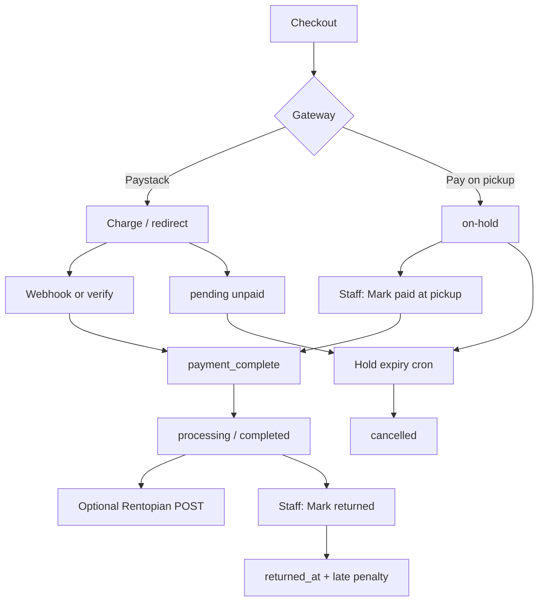

# Christocentric Rentals — Architecture Decision Record, API Schema & MVP

| | |
|--|--|
| **Product** | Christocentric Rentals (Ghana · GHS) |
| **Runtime** | WordPress + WooCommerce on Hostinger |
| **Local** | Laragon (`christocentricrentalswordpress.test`) |
| **Production** | https://christocentricrentals.com |
| **Document status** | Current as of Jul 2026 |
| **Related** | [README.md](README.md) · [IMPLEMENTATION.md](IMPLEMENTATION.md) · [DEPLOYMENT.md](DEPLOYMENT.md) |

---

## 1. Purpose

This document records:

1. **Architecture decisions** — why the store is built the way it is  
2. **API / integration schema** — every external and internal endpoint the MVP uses  
3. **MVP scope** — what ships now vs what is optional or deferred  

It describes the **WordPress rebuild**. The Laravel app at `../ChristocentricRentals/` is reference and catalog-export only — it is not part of the production runtime.

---

## 2. System context

```
┌──────────────────────┐         CSV / JSON / images          ┌─────────────────────────────┐
│ Laravel (reference)  │ ───────────────────────────────────► │ migration/ + scripts/       │
│ catalog export only  │                                      │ one-time / ops import       │
└──────────────────────┘                                      └──────────────┬──────────────┘
                                                                             │
                                                                             ▼
┌──────────────────────────────────────────────────────────────────────────────────────────┐
│                         WordPress (Hostinger / Laragon)                                    │
│                                                                                          │
│  Theme: christocentric          Storefront UI, pages, ACF homepage helpers               │
│  Plugin: christocentric-rentals Rental dates, holds, pickup, newsletter, SMTP, ops       │
│  Plugin: woocommerce            Catalog, cart, checkout, orders, stock, tax              │
│  Plugin: woo-paystack           Card / MoMo online payment                               │
│  Plugin: ACF (free)             Homepage CMS                                             │
│  Plugin: Rank Math              SEO                                                      │
└────────────┬───────────────────────────────┬───────────────────────────────┬─────────────┘
             │                               │                               │
             ▼                               ▼                               ▼
      Paystack API                    Hostinger SMTP                  Optional:
      (charge + webhook)              (order / reset mail)            Rentopian, Mailchimp,
                                                                      newsletter webhook
```

| Layer | Component | Responsibility |
|-------|-----------|----------------|
| Presentation | `wp-content/themes/christocentric/` | Shop UI, static pages, product cards, site config |
| Domain | `wp-content/plugins/christocentric-rentals/` | Daily pricing, availability, holds, pickup gateway, late returns, newsletter, SMTP |
| Commerce | WooCommerce | Products, stock, cart, checkout, order statuses, Ghana tax |
| Payments | `woo-paystack` | Paystack charge + webhook verification |
| Hosting | Hostinger | PHP 8.1+, MySQL, SSL, mailbox SMTP |
| Market rules | Store options | GHS, Ghana only, guest checkout **off**, Bomso pickup |

---

## 3. Architecture decision records (ADRs)

### ADR-001 — WordPress/WooCommerce rebuild (not Laravel in production)

| | |
|--|--|
| **Status** | Accepted |
| **Context** | Existing live shop and ops expect a familiar WooCommerce admin; Laravel app already held catalog/business logic. |
| **Decision** | Ship production on WordPress + WooCommerce. Keep Laravel as export/reference (`migration/`). |
| **Consequences** | Faster go-live for staff who know WP; rentals expressed as WC products + `_ccr_*` meta rather than a separate booking DB. |

### ADR-002 — Rentals as WooCommerce orders (no separate booking service)

| | |
|--|--|
| **Status** | Accepted |
| **Context** | Need daily rates, date ranges, stock holds, and staff workflows without a second inventory system. |
| **Decision** | Products = rentable gear. Orders = bookings. Line-item meta stores pickup/return dates and daily rate snapshots. Availability is computed from overlapping order lines + hold windows. |
| **Consequences** | Simple ops in **WooCommerce → Orders**. No custom REST booking API required for MVP. Overlap logic is SQL-based, not a dedicated calendar service. |

### ADR-003 — Dual payment rails (Paystack + pay on pickup)

| | |
|--|--|
| **Status** | Accepted |
| **Context** | Customers pay online (card/MoMo) or cash at Bomso. |
| **Decision** | Use `woo-paystack` for online; first-party gateway `ccr_pickup_cash` sets order to `on-hold` until staff marks paid. |
| **Consequences** | Two clear status paths. Stock can be held for unpaid pickup/abandoned checkout, then cancelled by cron. |

### ADR-004 — Tax via WooCommerce rates (Ghana 20% effective)

| | |
|--|--|
| **Status** | Accepted |
| **Context** | Ghana effective standard rate ≈ 20% = VAT 15% + NHIL 2.5% + GETFund 2.5%. Pickup-heavy checkout often has no shipping address. |
| **Decision** | Enable WC tax; prices exclusive of tax; calculate from **shop base address**; itemize three rates. One-click setup: **WooCommerce → Christocentric Rentals → Apply Ghana tax rates**. |
| **Consequences** | Paystack charges WC order total (incl. tax). Avoids “tax based on shipping” showing ₵0 on pickup orders. |

### ADR-005 — Rentopian optional

| | |
|--|--|
| **Status** | Accepted |
| **Context** | Legacy Laravel integrated Rentopian; live key may not be ready. |
| **Decision** | Outbound sync only when API key is set. Empty key = skip. Store runs fully on WooCommerce stock/orders. |
| **Consequences** | No hard dependency on external inventory for MVP go-live. |

### ADR-006 — No custom public REST API for MVP storefront

| | |
|--|--|
| **Status** | Accepted |
| **Context** | Storefront is server-rendered PHP; interactions are forms and small AJAX calls. |
| **Decision** | Use `admin-ajax.php` / `admin-post.php` + WooCommerce/Paystack hooks. Do not introduce a public GraphQL/REST booking API for MVP. |
| **Consequences** | Smaller attack surface and less client code. Future mobile/app clients would need a new ADR and versioned REST surface. |

### ADR-007 — Lean plugin surface

| | |
|--|--|
| **Status** | Accepted |
| **Decision** | Ship WooCommerce + christocentric-rentals + Paystack (+ ACF, Rank Math). Do not install Jetpack, MailPoet, ads/social commerce plugins. |
| **Consequences** | Better performance and fewer conflict/security vectors on Hostinger. |

### ADR-008 — Account-required checkout

| | |
|--|--|
| **Status** | Accepted |
| **Decision** | Guest checkout off — customers log in / register (matches prior live behaviour and first-time Ghana Card pickup policy). |

### ADR-009 — Email delivery via SMTP

| | |
|--|--|
| **Status** | Accepted |
| **Context** | Hostinger (and most hosts) block unreliable `mail()`. |
| **Decision** | Configure SMTP under **Christocentric Rentals** (Hostinger mailbox) so WooCommerce order, password-reset, and contact emails arrive. |
| **Consequences** | Order receipts are designed; delivery depends on SMTP credentials being set. |

---

## 4. Component map (plugin)

| Class | File | Role |
|-------|------|------|
| `Christocentric_Rentals` | `christocentric-rentals.php` | Bootstrap, activation |
| `CCR_Rental_Pricing` | `class-rental-pricing.php` | Inclusive day count, line totals |
| `CCR_Rental_Cart` | `class-rental-cart.php` | Date fields, cart meta, quote AJAX |
| `CCR_Rental_Availability` | `class-rental-availability.php` | Overlap vs stock |
| `CCR_Gateway_Pickup_Cash` | `class-pickup-cash-gateway.php` | Pay on pickup → `on-hold` |
| `CCR_Product_Meta` | `class-product-meta.php` | Daily/sale rates, featured, Rentopian ID |
| `CCR_Product_Kits` | `class-product-kits.php` | Bundled multi-item add-to-cart |
| `CCR_Rentopian_Sync` | `class-rentopian-sync.php` | Optional paid-order push |
| `CCR_Newsletter` | `class-newsletter.php` | Local subscribers + optional sync |
| `CCR_Contact_Form` | `class-contact-form.php` | Contact → support email |
| `CCR_Settings` | `class-settings.php` | Admin UI, Ghana tax, mark-paid |
| `CCR_Smtp` / `CCR_Email` | `class-smtp.php`, `class-email.php` | Mail transport + HTML branding |
| `CCR_Order_Admin` | `class-order-admin.php` | Rental columns, return ops |
| `CCR_Rental_Due` | `class-rental-due.php` | Due times, grace, late penalties |
| `CCR_Hold_Expiry` | `class-hold-expiry.php` | Hourly cancel unpaid holds |
| `CCR_Compare` | `class-compare.php` | Compare cookie (max 4) |
| `CCR_Legacy_Redirects` | `class-legacy-redirects.php` | Laravel URL → WP 301s |

---

## 5. Data model (MVP)

### 5.1 Product meta (`_ccr_*`)

| Key | Type | Purpose |
|-----|------|---------|
| `_ccr_price_per_day` | number | Daily rental rate |
| `_ccr_sale_price_per_day` | number | Promo daily rate |
| `_ccr_is_featured` | `yes`/`no` | Homepage featured |
| `_ccr_is_new` | `yes`/`no` | New badge |
| `_ccr_rating` | number | Sort / display |
| `_ccr_rentopian_id` | string | Optional external ID |
| `_ccr_is_kit` | `yes`/`no` | Kit product |
| `_ccr_kit_items` | serialized IDs | Kit components |
| `_ccr_rental_quantity` | int | Fallback qty if WC stock unmanaged |
| WC stock quantity | int | Primary inventory |

### 5.2 Order line-item meta

| Key | Purpose |
|-----|---------|
| `_ccr_rental_start` / `_ccr_rental_end` | Rental dates |
| `_ccr_pickup_time` / `_ccr_return_time` | Times |
| `_ccr_rental_days` | Computed day count |
| `_ccr_price_per_day` | Rate snapshot at purchase |
| `_ccr_returned_at` | Staff marked returned |
| `_ccr_late_penalty` | Late fee on line |

### 5.3 Order meta

| Key | Purpose |
|-----|---------|
| `_ccr_payment_method` | e.g. `pickup_cash` |
| `_ccr_total_late_penalty` | Sum of line penalties |
| `_ccr_rentopian_synced` | `yes` after successful push |

### 5.4 Newsletter table

`{wpdb_prefix}ccr_newsletter_subscribers`

| Column | Purpose |
|--------|---------|
| `email` | Subscriber address |
| `unsubscribe_token` | Secure unsubscribe |
| `subscribed_at` / `unsubscribed_at` | Lifecycle |

### 5.5 Tax (WooCommerce)

| Name | Rate | Country |
|------|------|---------|
| VAT | 15% | GH |
| NHIL | 2.5% | GH |
| GETFund | 2.5% | GH |

Prices entered **exclusive** of tax. Display itemized. Based on **shop base address**.

### 5.6 Holds

| Setting | Default | Meaning |
|---------|---------|---------|
| `ccr_pickup_cash_hold_hours` | 72 | Unpaid pickup reservation window |
| `ccr_online_hold_hours` | 2 | Abandoned online checkout window |

Cron: `ccr_expire_unpaid_holds` (hourly) cancels expired `pending` / `on-hold` orders.

---

## 6. Order lifecycle



| Path | Status flow | Customer email (if SMTP on) |
|------|-------------|------------------------------|
| Paystack | pending → paid → processing/completed | Processing / order confirmation |
| Pay on pickup | **on-hold** → staff mark paid → **processing** | On-hold, then processing when marked paid |
| Expired hold | pending/on-hold → **cancelled** | Cancellation (if enabled) |

Availability counts overlapping lines in `processing` / `completed`, plus unpaid `pending` / `on-hold` still inside the hold window.

---

## 7. API & integration schema (MVP)

There is **no custom `register_rest_route` surface** in `christocentric-rentals` for the storefront. Integrations use WordPress AJAX/admin-post, WooCommerce APIs, and outbound HTTP.

Base paths:

- AJAX: `{site}/wp-admin/admin-ajax.php`
- Form posts: `{site}/wp-admin/admin-post.php`

### 7.1 Storefront endpoints

#### `POST admin-ajax.php?action=ccr_rental_quote`

Live rental quote while choosing dates.

| Field | Notes |
|-------|--------|
| Auth | Nonce `ccr_rental_quote` (logged-in or guest) |
| Typical body | Product ID, start/end dates, times, qty |
| Response | Days, total, availability flags (JSON) |

#### `POST admin-ajax.php?action=ccr_compare_toggle`

| Field | Notes |
|-------|--------|
| Auth | Nonce `ccr_compare`; guest OK |
| Purpose | Add/remove product in compare cookie (max 4) |

#### `POST admin-post.php?action=ccr_compare`

| Field | Notes |
|-------|--------|
| Auth | Nonce `ccr_compare` |
| Purpose | Compare add/remove/clear + redirect |

#### `POST admin-post.php?action=ccr_contact_form`

| Field | Notes |
|-------|--------|
| Auth | Nonce `ccr_contact_form` + honeypot |
| Purpose | Email support |

#### `POST admin-post.php?action=ccr_newsletter_subscribe`

| Field | Notes |
|-------|--------|
| Auth | Nonce `ccr_newsletter` + honeypot |
| Purpose | Insert local subscriber; optional Mailchimp / webhook |

#### `GET /newsletter/unsubscribe/{token}/`

Tokenized unsubscribe (rewrite rule).

### 7.2 Admin endpoints

| Endpoint | Auth | Purpose |
|----------|------|---------|
| `POST admin-post.php?action=ccr_smtp_test` | Shop manager | Send SMTP test |
| `POST admin-post.php?action=ccr_setup_ghana_tax` | `manage_woocommerce` + nonce | Enable tax + install GH rates |
| `POST admin-post.php?action=ccr_export_subscribers` | Admin | CSV export |
| `POST admin-post.php?action=ccr_mark_returned` | `edit_shop_orders` + nonce | Mark line returned + penalty |
| WC order action `ccr_mark_paid` | Shop manager | Pickup cash → `payment_complete` |

### 7.3 Paystack webhook (inbound)

| | |
|--|--|
| **Provider** | Paystack via `woo-paystack` |
| **URL pattern** | `{site}/?wc-api=Tbz_WC_Paystack_Webhook` |
| **Method** | POST |
| **Purpose** | Confirm payment; advance order to paid/processing |
| **MVP requirement** | **Required** for reliable live online payments |

Configure the same URL in the Paystack dashboard webhook settings when switching to live keys.

### 7.4 Outbound integrations (optional)

#### Rentopian — `POST {ccr_rentopian_base_url}/orders`

| | |
|--|--|
| Auth | Bearer `ccr_rentopian_api_key` |
| When | Order paid / processing / completed / marked paid |
| Body | Order payload mirrored from legacy sync service |
| If unset | Sync skipped (logged); store continues |

#### Newsletter webhook — `POST {ccr_newsletter_webhook_url}`

```json
{
  "email": "user@example.com",
  "source": "footer",
  "site": "https://christocentricrentals.com",
  "subscribed_at": "2026-07-30T12:00:00+00:00"
}
```

#### Mailchimp — `PUT` audience member

Uses `ccr_mailchimp_api_key` + `ccr_mailchimp_list_id` when set.

### 7.5 WooCommerce / WordPress built-ins used by MVP

| Surface | Use |
|---------|-----|
| WooCommerce product / order APIs (internal) | Catalog & bookings |
| WooCommerce emails | Customer receipt, on-hold, processing; admin new order |
| `wp_mail` → `CCR_Smtp` | Transport for all WP/WC mail when SMTP enabled |
| Cron `ccr_expire_unpaid_holds` | Hold expiry |

---

## 8. MVP definition

### 8.1 In MVP (ship)

- [x] WordPress + WooCommerce storefront (theme `christocentric`)
- [x] Catalog: products, categories, search, thumbnails, pagination
- [x] Daily rental pricing + sale rates + kits
- [x] Cart/checkout date/time fields + availability checks
- [x] Stock holds + hold expiry cron
- [x] Paystack (test → live keys at go-live) + pay on pickup
- [x] Ghana tax (VAT + NHIL + GETFund) via WC
- [x] Account-required checkout
- [x] Static pages: About, FAQ, Contact, Terms, Privacy, Help, Studio
- [x] Contact form + newsletter (local list)
- [x] Compare (max 4)
- [x] Homepage CMS (ACF Free)
- [x] Rank Math SEO
- [x] Order admin: rental dates, mark paid, mark returned, late penalties
- [x] Legacy URL redirects
- [x] Branded WC emails (logo) + SMTP settings UI

### 8.2 Go-live ops (MVP launch checklist, not new product scope)

- [ ] SMTP credentials on Hostinger + prove order + password-reset mail
- [ ] Paystack **live** keys + webhook URL
- [ ] End-to-end test: Paystack + pickup cash
- [ ] Production URL/search-replace complete; LiteSpeed/CDN purged
- [ ] Spot-check images/categories; confirm redirects on prod

### 8.3 Explicitly out of MVP / optional later

| Item | Notes |
|------|--------|
| Rentopian live sync | Optional until API key confirmed |
| Mailchimp / newsletter webhook | Optional; local list is enough |
| Public versioned REST/GraphQL booking API | New ADR if mobile app needs it |
| Guest checkout | Intentionally off |
| Marketing plugins (Jetpack, MailPoet, ads) | Do not install |
| Multi-currency / multi-country | Ghana + GHS only |
| Full calendar SaaS inventory | WC stock + date overlap is MVP |

---

## 9. Security & ops notes (MVP)

- Nonces on all custom AJAX/admin-post actions; honeypots on public forms.
- Capabilities: tax setup / settings require `manage_woocommerce`; order returns require `edit_shop_orders`.
- Keep cart, checkout, and account pages **excluded** from full-page cache.
- Do not commit production `wp-config.php`, SMTP passwords, or Paystack secret keys.
- Prefer Hostinger backups (or UpdraftPlus) after go-live.

---

## 10. Future API sketch (not implemented)

If a mobile app or partner needs a public API later, prefer a **versioned WP REST** namespace such as:

```
GET  /wp-json/ccr/v1/products
GET  /wp-json/ccr/v1/products/{id}/availability?start=&end=
POST /wp-json/ccr/v1/quotes
POST /wp-json/ccr/v1/orders   (auth: application password / JWT)
```

That would be a **new ADR**. MVP does not expose these routes.

---

## 11. Key file index

| Path | Role |
|------|------|
| `wp-content/plugins/christocentric-rentals/christocentric-rentals.php` | Plugin entry |
| `wp-content/plugins/christocentric-rentals/includes/class-settings.php` | Settings, Ghana tax, mark-paid |
| `wp-content/plugins/christocentric-rentals/includes/class-rental-cart.php` | Dates + quote AJAX |
| `wp-content/plugins/christocentric-rentals/includes/class-rental-availability.php` | Availability |
| `wp-content/plugins/woo-paystack/` | Paystack gateway + webhook |
| `wp-content/themes/christocentric/` | Storefront |
| `scripts/setup-ghana-tax.php` | CLI tax setup (local/ops) |
| `migration/` | Laravel export artifacts |

---

*End of document.*
