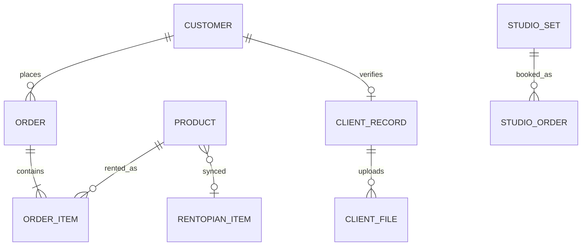

# Christocentric Rentals — Project Write-up

**Course:** COE 454 (Client Project), KNUST  
**Client:** Christocentric Rentals  
**Location:** Bomso, Kumasi, Ghana (near Abesse Gaming Center)  
**Approximate locality GPS:** 6.6833° N, 1.5833° W (Bomso, Kumasi Metro — confirm the shop pin in Google Maps / GhanaPost before the course form)  
**Live shop:** https://christocentricrentals.com  
**Live studio booking:** https://studio.christocentricrentals.com  
**Local development:** http://christocentricrentalswordpress.test (Laragon)

This write-up follows the lecturer’s requested shape: **the client’s problem**, **our proposed solution**, then **how the system is actually implemented**. Discovery input includes a Google Meet with the client on **26 June 2026**. The inventory product they already use is treated as confidential on that call; later engineering work identified it as **Rentopian**. GPS hardware tracking of cameras in the field is **not** in this MVP.

---

## 1. The client’s problem

### 1.1 Business context

Christocentric Rentals is a registered creative-industry business in Bomso, Kumasi. They run two lines of work from the same premises:

1. **Equipment hire** — cameras, lenses, lights, gimbals, and related gear that customers take away and return.
2. **Studio hire** — customers come on site and book a **set** inside the studio (not the whole room) for pictures or video.

Demand follows the event calendar. Friday–Sunday is typically busy; quieter weeks track quieter event schedules. Staff already keep inventory and know **who collected which item**, using software they already paid for. They also had a public website and WordPress / hosting logins. What they did **not** have was a finished, trustworthy online shop that they could leave running after hours.

### 1.2 Who is affected, and how they cope today

| Who | What goes wrong | How they cope now |
|-----|-----------------|-------------------|
| **Customers** (filmmakers, photographers, students, event crews) | Cannot reliably browse, search, or book gear online. After-hours they call and get no one. | Phone calls, WhatsApp, walking in during opening hours. |
| **Staff** | After ~22:00 they cannot take bookings. They must manually keep the public site aligned with what is actually on the shelf. | Answer phones when they can; turn people away after hours; double-check stock in the inventory tool. |
| **The business** | A previous website build stalled. Search on the public catalog did not work. The site was not linked to live availability. | Offline / informal booking; leftover incomplete web work (the old Hostinger site was even an unrelated Electro demo catalog, not their cameras). |

Two example users (personas) make this concrete:

- **Ama, freelance videographer.** She gets a Saturday wedding brief on Friday night. She needs a gimbal and a fast lens for 24 hours, paid on MoMo, collected in Bomso in the morning. If the website says “in stock” but the item is already out, she loses the job.
- **Kojo, studio walk-in.** He wants Set 3 for a one-hour portrait session on Sunday afternoon. He cannot visit during the week. He needs to see which slots are taken and pay before he travels.

### 1.3 Problems the client asked software to solve

From the 26 June 2026 discovery call (paraphrased; the auto-transcript is noisy):

1. **The public website was incomplete.** A previous builder did not finish it. The business could not run hiring through the site.
2. **Search did not work.** A catalog existed, but customers could not find gear by name.
3. **No after-hours booking.** Customers call around **22:00** when staff cannot serve. The client wanted **24/7 booking on the website**.
4. **The website was not tied to live inventory.** The shop must show **only available** items. Unavailable gear must not look bookable. The site must talk to the inventory system they already use.
5. **They wanted stronger tracking of cameras in the field.** They can already log who took an item. Real-time GPS / hardware tracking of digital cameras is a **hardware + subscription** problem. It is **out of this software MVP** unless the client later buys trackers.

### 1.4 What “success” means for this problem

If the site is working, a customer at 22:00 can search the real catalog, see whether a camera is free for a 24-hour window, create an account, pay (or reserve for cash on pickup), and collect at Bomso. Staff should see the order in WooCommerce, and paid hires should show up in the existing inventory tool so the shelf and the website do not disagree. Studio customers should book a numbered set, pay full MoMo, and see greyed-out slots so two people cannot take the same hour.

---

## 2. Proposed solution

### 2.1 Value proposition

**Christocentric Rentals’ customers can hire gear and book studio sets online, any hour of the day, against live availability — with Ghana payments and Bomso pickup — instead of calling a closed shop.**

The team did not replace WordPress with a new app from scratch. The client already lived in WordPress and WooCommerce admin. Production is therefore a **custom rental storefront on WordPress**, hosted on **Hostinger**, with a first-party plugin that turns ordinary WooCommerce products into **time-bounded rentals**, plus a **studio booking** surface on a subdomain.

### 2.2 What we shipped (mapped to the problems)

| Client problem | What the solution does |
|----------------|------------------------|
| Incomplete website | Custom theme `christocentric` + plugin `christocentric-rentals` **1.9.18**: shop, account, checkout, studio, contact, legal pages. Live at christocentricrentals.com. |
| Broken search | Header and shop search (`?s=` on the shop archive) over WooCommerce products, plus nested category navigation. |
| After-hours booking | Public checkout 24/7. Guest checkout is **off** (identity matters for expensive gear). Google sign-in is available. Unpaid reservations expire automatically so overnight abandoned carts do not lock the fleet forever. |
| Site vs inventory | Catalog **pull** from the existing inventory API into WooCommerce. Paid shop orders **push** back so quantity / availability can fall. Date overlap logic hides or blocks gear that is already out. |
| Field GPS tracking | **Not built.** Logged pickup identity (Ghana Card / verification) is the software substitute for “who took it.” Hardware trackers remain a later, paid scope. |

### 2.3 Two products, two payment stories

The client was clear that **taking gear home** and **using the studio** are different businesses:

- **Shop rentals** use WooCommerce checkout. Customers pay **Paystack** (card / mobile money) or **cash on pickup** at Bomso (not “cash on delivery”). Copy says **Delivery**, not Shipping. After payment, the thank-you page is a simple “what you paid for” summary with pickup/return times.
- **Studio bookings** are **full MoMo**, sent manually to the business number, with payment reference **Studio Rentals**. This is **not** Paystack and **not** a 50% deposit. Unpaid holds grey the slot for about **10 minutes**; confirmed paid stays grey until the slot ends.

### 2.4 What we deliberately did not promise

- A native mobile app or public JWT booking API (the storefront is server-rendered PHP).
- Multi-country / multi-currency (Ghana, GHS only).
- Replacing the client’s inventory package; we **integrate** with it.
- GPS anti-theft devices.

---

## 3. Implementation

This section is the technical heart of the report. The design is “WooCommerce does commerce; our plugin does *rental time*.”

### 3.1 System overview

```
Customers (browser, mobile)
        │
        ▼
┌─────────────────────────────────────────────────────────────┐
│  Hostinger — WordPress + PHP 8.1+ + MySQL + HTTPS           │
│                                                             │
│  Theme: christocentric          UI, shop, ACF homepage      │
│  Plugin: christocentric-rentals  Dates, holds, studio, sync │
│  WooCommerce                    Catalog, cart, orders, tax  │
│  woo-paystack                   Card / MoMo for shop        │
│  ACF (free)                     Homepage CMS                │
│  Rank Math                      SEO                         │
│                                                             │
│  DB 1: WordPress / WooCommerce  (products, orders)          │
│  DB 2: Client verification      (IDs, GPS photos) — isolated│
└──────────┬──────────────┬──────────────┬────────────────────┘
           │              │              │
           ▼              ▼              ▼
     Paystack API    Gmail SMTP     Inventory API (Rentopian)
     (shop pay +     (receipts,     pull catalog / push orders
      webhook)        late mail)     (optional until key set)
           │
           ▼
     Studio: MTN MoMo (manual), WhatsApp confirm
```

**Studio** is the same WordPress install, routed on `studio.christocentricrentals.com` (`CCR_Studio_Subdomain`). It is not a second codebase.

A previous **Laravel** app exists only as catalog export / reference. It is **not** the live site.

### 3.2 Why WordPress (ADRs, in short)

The course brief uses JWT + a custom REST API as *examples*, not a mandate. These decisions are written as ADRs because they are the ones that actually shipped.

| ID | Decision | Why |
|----|----------|-----|
| **ADR-001** | Production on **WordPress + WooCommerce**, not Laravel. | Staff already had WP/hosting; faster go-live; Laravel kept as export. |
| **ADR-002** | A **rental is a WooCommerce order**. Pickup/return live in line-item meta (`_ccr_*`). | One admin: **WooCommerce → Orders**. No second booking database for gear. |
| **ADR-003** | **Two shop rails:** Paystack + pay-on-pickup (`ccr_pickup_cash` → `on-hold` until staff mark paid). | Matches how Bomso actually collects money. |
| **ADR-004** | Ghana tax as **three WooCommerce rates** (VAT 15%, NHIL 2.5%, GETFund 2.5%), calculated from **shop base address**, toggleable without deleting rates. | Pickup orders often have no shipping address; “tax from shipping” would show ₵0. |
| **ADR-005** | Inventory sync is **optional** until an API key is set. Pull is default-on; **push-on-save is default-off** (push overwrites the inventory catalog). | Shop can sell even if the external API is down; staff must not wipe Rentopian by accident. |
| **ADR-006** | **No public GraphQL/REST booking API** for MVP. Use `admin-ajax.php` / `admin-post.php` + Woo/Paystack hooks. | Smaller attack surface; the UI is PHP, not a SPA. |
| **ADR-007** | Lean plugin list (no Jetpack / MailPoet / ads). | Hostinger performance and fewer conflicts. |
| **ADR-008** | **Accounts required** for checkout. Google OAuth optional. First-time **client verification** (Ghana Card, guarantor, GPS address photo). | High-value gear; first-time Ghana Card pickup policy. |
| **ADR-009** | Mail through **SMTP** (`christocentricrentals@gmail.com`), not raw `mail()`. | Hosts drop PHP mail; receipts and late notices must arrive. |
| **ADR-010** | Studio money is **manual full MoMo**, not Paystack. | Client rule: studio ≠ shop checkout. |

### 3.3 Folders that matter

| Path | Role |
|------|------|
| `wp-content/themes/christocentric/` | Storefront: `front-page.php`, shop templates, cart/checkout/account, cookie consent, studio page. |
| `wp-content/plugins/christocentric-rentals/` | Domain logic. Bootstrap: `christocentric-rentals.php`. |
| `wp-content/plugins/woocommerce/` | Products, stock fields, cart, checkout, order statuses. |
| `wp-content/plugins/woo-paystack/` | Paystack charge + webhook `/?wc-api=…`. |
| `scripts/` | Local setup (activate theme, Ghana tax, stock). Not a public API. |
| `migration/` | One-time Laravel export. Do not deploy as the live catalog source of truth. |

Plugin classes (implementation map):

| Class | File | Job |
|-------|------|-----|
| `CCR_Rental_Pricing` | `class-rental-pricing.php` | Count **24-hour periods** (not calendar days); clamp return to closing time. |
| `CCR_Rental_Cart` | `class-rental-cart.php` | Date/time fields, live quote AJAX, default 24h window, cart totals. |
| `CCR_Rental_Availability` | `class-rental-availability.php` | SQL overlap vs fleet quantity; WooCommerce must **not** decrement stock on pay (rentals come back). |
| `CCR_Hold_Expiry` | `class-hold-expiry.php` | Hourly cron: cancel stale unpaid holds. |
| `CCR_Rental_Due` / `CCR_Late_Notices` | `class-rental-due.php`, `class-late-notices.php` | Grace + late fee; email when the hire enters a new late 24h block (hour 25+). |
| `CCR_Gateway_Pickup_Cash` | `class-pickup-cash-gateway.php` | Cash at Bomso; Ghana Card reminder. |
| `CCR_Rentopian_Catalog` / `CCR_Rentopian_Sync` | `class-rentopian-catalog.php`, `class-rentopian-sync.php` | Pull/push catalog; POST paid orders. |
| `CCR_Google_Auth` | `class-google-auth.php` | OAuth start/callback; force login before checkout. |
| `CCR_Rental_Agreement` | `class-rental-agreement.php` | First-time verification modal; blocks checkout until complete. |
| `CCR_Client_Store` | `class-client-store.php` | **Separate MySQL** + private files, not the product Media Library. |
| `CCR_Studio_*` | `class-studio-cpt.php`, `class-studio-settings.php`, `class-studio-booking.php`, `class-studio-subdomain.php` | Sets 1–5, MoMo booking, slot holds, subdomain. |
| `CCR_Compare` | `class-compare.php` | Cookie list, max 4 products. |
| `CCR_Smtp` / `CCR_Email` | `class-smtp.php`, `class-email.php` | Transport + branded HTML mail. |

### 3.4 Data model (entities)

Think of four clusters. This is the ERD in words (enough for the brief’s “≥4 entities”).

**1. Catalog (WordPress posts)**  
`WP_Post` of type `product` + WooCommerce product meta. Extra keys:

- `_ccr_price_per_day`, `_ccr_sale_price_per_day`
- `_ccr_rental_quantity` (fallback if WC stock is unmanaged)
- `_ccr_rentopian_id` (link to external inventory)
- `_ccr_is_kit` / `_ccr_kit_items` (bundle adds several products at once)
- `_ccr_is_featured`, `_ccr_is_new`

WooCommerce stock quantity is the primary fleet size. The plugin **turns off** WooCommerce’s usual “reduce stock on purchase,” because a rental is not a sale: the camera is supposed to come back. Availability is **time overlap**, not a single integer that only goes down.

**2. Booking (shop order)**  
`shop_order` + line items. Each line stores:

- `_ccr_rental_start` / `_ccr_rental_end`
- `_ccr_pickup_time` / `_ccr_return_time`
- `_ccr_rental_days` (number of 24-hour periods)
- `_ccr_price_per_day` (snapshot so later price edits do not rewrite old orders)
- `_ccr_returned_at`, `_ccr_late_penalty`

Order-level: `_ccr_payment_method`, `_ccr_rentopian_synced`, `_ccr_total_late_penalty`.

**3. Studio**  
Custom post type for **sets** (Set 1–5). A studio booking is still a WooCommerce order, flagged `_ccr_is_studio_booking = 1`, with `_ccr_studio_id`, `_ccr_studio_date`, `_ccr_studio_start`, `_ccr_studio_end`. Those orders are **excluded** from Rentopian gear sync (you do not decrement a camera SKU because someone booked a cyclorama set).

**4. Identity (isolated)**  
Tables `ccr_clients` and `ccr_client_files` live in a **second database** (`CCR_CLIENTS_DB_*` in `wp-config.php`, above the “stop editing” line). Files sit under `uploads/ccr-clients/` with `.htaccess` protection, served only to logged-in staff via `wp_ajax_ccr_client_file`. Product photos never share that folder. Verification uploads are also tagged `_ccr_private_verification` so they do not appear in the Media Library picker next to a Sony lens.

**5. Newsletter**  
Table `{prefix}ccr_newsletter_subscribers` (email, unsubscribe token, timestamps). Optional Mailchimp / webhook.



### 3.5 Shop rentals: 24-hour periods, not calendar days

The business rule is: **a rental is 24 hours from pickup**, not “today counts as one day.”

`CCR_Rental_Pricing::rental_days()` takes start date + pickup time and end date + return time, then:

```text
periods = ceil( (return_timestamp − pickup_timestamp) / 86400 )
```

Exactly 24 hours = 1 period. One second into the next block = 2 periods. Minimum is 1.

On the product page, choosing a pickup time **auto-fills return = pickup + 24 hours**, then **clamps** the clock to latest return (**20:50** by default, admin: “Latest return time”). Shop open is **08:00**. Quick-add on product cards uses that same default window.

**Availability** (`CCR_Rental_Availability::booked_quantity`) is a SQL join across order items:

- Count quantity where rental date ranges **overlap** the requested window.
- Include orders in `processing` / `completed`.
- Also include unpaid `pending` / `on-hold` **while they are still inside the hold window** (so two people cannot reserve the last Sony body at the same time).
- Pickup-cash hold default: **72 hours**. Abandoned online checkout hold: **2 hours**.
- Hourly cron `ccr_expire_unpaid_holds` cancels expired unpaid orders so the fleet frees itself overnight.

Checkout runs `woocommerce_check_cart_items` → `validate_cart_availability` so a customer cannot pay for a camera that was taken while they were filling the form.

**Late returns:** `CCR_Rental_Due` adds a grace period (default **30 minutes**). After that, each extra 24-hour block bills another daily rate (multiplier option, default 1). Cron `ccr_check_late_rentals` emails the customer when they enter the first late block (**after 25 hours** from due, i.e. first `late_days >= 1`) and again if another block starts. Staff **Mark returned** on the order writes `_ccr_returned_at` and can apply the penalty.

### 3.6 Shop payments and order lifecycle

```text
Checkout
  ├─ Paystack (woo-paystack) → charge → webhook → payment_complete
  │                              → processing/completed
  │                              → optional POST to inventory /orders
  │                              → thank-you “what you paid for”
  └─ Pay on pickup → on-hold (stock held)
                     ├─ Staff: Mark paid → payment_complete (same as above)
                     └─ Hold expiry cron → cancelled
```

Paystack is the Sprint 2 third-party payment for **gear**. Live webhook must be registered in the Paystack dashboard (pattern `{site}/?wc-api=…`). Test keys stay on Laragon; production uses live keys. Channels: card and Ghana mobile money.

Pickup copy tells the customer to bring a **valid Ghana Card**. That is policy, not a payment API.

### 3.7 Studio booking

Guests book **Set 1–5**, each a custom post staff can edit (name, photos, packages). Defaults:

- Pictures **GHS 200 / hour**, video **GHS 300 / hour** (guest picks duration; extra hours use the same hourly rate).
- Add-ons: lenses **70**, standard cameras **80**, Blackmagic / SF6 **100**; makeup space 70; several “contact us” items (lights, parking).
- Opening/closing aligned with the shop (close **20:50**).
- `deposit_50` is forced **off**; `deposit_100` is forced **on**.

Front end calls:

- `ccr_studio_taken_slots` — greys busy hours for a date or a month.
- `ccr_studio_create_booking` — creates the WC order as awaiting MoMo.

Unpaid studio orders hold the slot for **10 minutes** (`AWAITING_HOLD_MINUTES`), then `release_expired_awaiting_holds()` frees them. Paid orders keep the slot until the end time.

The studio agreement is shown **on every studio visit** (summary + PDF download), which is stricter than the shop’s one-time verification.

Staff confirm payment in WooCommerce; the customer return URL lands on the studio success view, not the generic shop thank-you.

### 3.8 Linking the website to existing inventory

Admin: **WooCommerce → Christocentric Rentals**.

- **Pull** copies products from `https://account.rentopian.com/api/v1` into WooCommerce (name, description, price, qty, image **URL** — not a PNG upload). Can run twice daily via cron `ccr_rentopian_pull_catalog`. This is how the public shop stays aligned with what staff already track.
- **Push** writes WooCommerce products **back** and **overwrites** the inventory catalog. Auto push-on-save stays **off** unless someone turns it on.
- When a **shop** order is paid / processing / completed / marked paid, `CCR_Rentopian_Sync::maybe_push_order` POSTs the order so the other system can drop quantity. Studio orders are skipped. A `_ccr_rentopian_synced` flag prevents double POST.

If the API key is empty, the shop still runs on WooCommerce stock and dates; sync is skipped and logged.

Photos for the storefront can also be attached from a Hostinger folder `public_html/Products Images/00000/…` (same level as `wp-admin`). That is an ops tool, not the inventory API.

### 3.9 Accounts, Google sign-in, client verification

Guest checkout is disabled. Hitting checkout while logged out redirects to My Account with `redirect_to` back to checkout.

**Google:** `admin-post.php?action=ccr_google_start` sends the user to Google; `template_redirect` handles the OAuth callback. Needs `ccr_google_enabled`, client ID, and secret.

**First-time shoppers** must complete **Client Data Verification** (`CCR_Rental_Agreement`): Ghana Card (self + guarantor), residential GPS address + photo, etc. Checkout is blocked until it is saved. Admin can see submissions. Files go to the isolated client DB / folder, not next to product images.

Cookie consent is required on the storefront (theme template `cookie-consent.php`).

### 3.10 Storefront, search, and CMS

The previous public site failed at **search**. This theme runs product search on the shop archive (`ccr_shop_search_query()` / `name="s"`), nested category groups in the shop sidebar, compare (max 4), kits, and a new-arrivals strip that **hides if empty**.

Homepage sections (heroes, trust bar, brand logos, newsletter copy) are edited via **ACF Free** on a private “Homepage CMS” page (**Appearance → Homepage CMS**), because free ACF has no Options Pages. Empty fields fall back to categories / `migration/site-settings.json`.

Rank Math handles SEO. Legacy Laravel URLs 301 via `CCR_Legacy_Redirects`.

Performance choices: 12 products per page, thumbnail sizes (not full originals) on cards, short cache on anonymous catalog pages, cart/checkout/account **excluded** from full-page cache.

### 3.11 Tax, email, and scheduled jobs

**Tax:** one-click **Apply Ghana tax rates** installs VAT / NHIL / GETFund. **Toggle taxes** turns WooCommerce tax off or on **without deleting** the rates (live was flaky until tax classes were synced). Prices are entered exclusive of tax.

**Email:** plugin SMTP UI; from address `christocentricrentals@gmail.com`. Used for WooCommerce receipts, contact form, newsletter welcome, and late-rental notices.

**Crons (WordPress cron):**

| Hook | Interval | Purpose |
|------|----------|---------|
| `ccr_expire_unpaid_holds` | hourly | Release abandoned reservations |
| `ccr_check_late_rentals` | hourly | Late penalty emails |
| `ccr_rentopian_pull_catalog` | twice daily | Pull inventory if configured |

### 3.12 Endpoints (honest count for the course form)

There is **no** public `/wp-json/ccr/v1/…` booking API. Custom surface is WordPress AJAX / admin-post, plus Paystack’s webhook and outbound HTTP to inventory.

**Customer-facing (count these as the public API):**

| Method | Path / action | Purpose |
|--------|----------------|---------|
| POST | `admin-ajax.php?action=ccr_rental_quote` | Live 24h quote + availability |
| POST | `admin-ajax.php?action=ccr_quick_add` | Add with default 24h window |
| POST | `admin-ajax.php?action=ccr_compare_toggle` | Compare cookie |
| POST | `admin-post.php?action=ccr_compare` | Compare form post |
| POST | `admin-post.php` contact action | Contact form (nonce + honeypot) |
| POST | `admin-post.php` newsletter subscribe | Local list |
| GET | `/newsletter/unsubscribe/{token}/` | Unsubscribe |
| POST | `admin-ajax.php?action=ccr_studio_taken_slots` | Grey studio hours |
| POST | `admin-ajax.php?action=ccr_studio_create_booking` | Create MoMo studio order |
| GET/POST | `admin-post.php?action=ccr_google_start` | OAuth start |
| GET | site callback (template_redirect) | Google OAuth return |
| POST | `admin-post.php?action=ccr_account_continue` | Email continue / account gate |
| POST | `admin-post.php?action=ccr_save_rental_agreement` | Verification form |
| POST | `/?wc-api=…` (Paystack plugin) | Payment webhook |

That is **14 public/custom inbound endpoints**, plus WooCommerce’s own checkout posts.

**Staff / ops (not for random browsers):** SMTP test, Ghana tax setup/toggle, Rentopian pull/push/keep-only/categorize/fallback photos, attach folder photos, export subscribers, mark returned, verification CSV import/template, `ccr_client_file` (auth’d file serve), WooCommerce order action **Mark paid**.

**Outbound:** `POST {rentopian}/orders`, optional Mailchimp PUT, optional newsletter webhook.

All custom POSTs use **nonces**; public forms also use **honeypots**. Capabilities: `manage_woocommerce` for settings/sync; `edit_shop_orders` for returns.

### 3.13 Security and NFRs (as built)

| NFR | How it is handled |
|-----|-------------------|
| HTTPS | Hostinger SSL on christocentricrentals.com |
| Secrets | Production `wp-config.php` is **not** the Laragon file. No Paystack secrets in git. Client DB password must be real, never the placeholder `paste-the-password-here`. |
| PII isolation | Verification IDs in a **second database** and blocked from product Media Library. |
| Session / identity | Accounts required; verification before first checkout. |
| Availability integrity | Overlap SQL + holds + cron; Woo stock decrement disabled for rentals. |
| Mail reliability | SMTP, not `mail()`. |
| Cache | Cart/checkout/account uncached. |
| File edit | `DISALLOW_FILE_EDIT` recommended on production. |

### 3.14 Hosting and how we deploy

- **Host:** Hostinger (`public_html`).
- **DB:** MySQL for WordPress; **second** MySQL for clients (`CCR_CLIENTS_DB_NAME` / `USER` / `PASSWORD` / `HOST`).
- **PHP:** 8.1+ (local Laragon often 8.3).
- **Typical update:** replace `wp-content/plugins/christocentric-rentals` as a whole folder. Do **not** upload local `wp-config.php`, the entire `wp-content`, or `migration/`.
- **CI/CD:** not a GitHub Actions production pipeline on Hostinger for this MVP. Deploy is SFTP / File Manager. (Week 7–8 “scale + CI” would add Actions on a staging clone; that is future work, not a fake pipeline.)

Local: Laragon, database `christocentric_wp`, user `root`, empty password, hosts entry for `christocentricrentalswordpress.test`.

### 3.15 If this had to scale (lecturer question)

Today the bottleneck is **PHP + MySQL on one Hostinger account**, with availability computed by joining order item meta. That is correct for one Bomso shop and a few hundred SKUs.

To reach thousands of concurrent bookers you would:

1. Move overlap checks to a **dedicated availability table** (product_id, start, end, qty) updated on order status, with indexes — stop scanning all line meta on every quote.
2. Put **Redis** in front of quotes and studio slot maps.
3. Run **WooCommerce on a separate app server** from the database; object cache + queue for Rentopian POSTs and email.
4. Keep Paystack webhooks idempotent (already gated by `_ccr_rentopian_synced`-style flags).
5. Only then consider a versioned REST API (`/wp-json/ccr/v1/…`) if a mobile app appears — that would be a **new ADR**.

Market expansion (Accra branch, second studio) is a **multi-location inventory** problem, not a CSS problem: each SKU would need a location_id in the overlap table.

### 3.16 Challenges and lessons

- The old live site was an **Electro demo** (bikes/laptops), not the camera catalog. Trust the inventory pull and real product copy, not leftover WP demo products.
- **Tax classes** had to be synced before Ghana VAT appeared correctly at checkout.
- **Pull vs push** on inventory is easy to get backwards; push-on-save stays off.
- Client verification needs a **real** second-database password on Hostinger; an empty password is rejected on purpose.
- Attaching a large `Products Images/00000` tree can hang if the folder is incomplete — ops, not a customer feature.
- Hardware GPS tracking sounded like a software ticket on the discovery call; it is not. Identity + availability is what this stack can honestly deliver.

---

## 4. Primary user flows (for the demo video)

**Customer — gear (the flow that fixes 22:00 booking):**  
Open christocentricrentals.com → search or category → pick dates (return auto +24h) → add to cart → sign in / Google → complete verification if first time → Paystack or cash on pickup → thank-you page → collect at Bomso.

**Customer — studio:**  
studio.christocentricrentals.com → agree → pick Set → pictures/video hours → see grey slots → pay full MoMo with reference **Studio Rentals** → staff mark paid → slot stays booked.

**Staff:**  
WooCommerce → Orders (rental columns) → mark paid / mark returned → Christocentric Rentals settings (tax toggle, SMTP, inventory pull). Do not click **Push products** unless overwriting the inventory catalog is intended.

---

## 5. Course form cheat-sheet (fill with team facts)

| Field | Value from this project |
|-------|-------------------------|
| Client business | Christocentric Rentals |
| Location | Bomso, Kumasi, Ghana (near Abesse Gaming Center) |
| GPS | Confirm shop pin; locality ~ 6.6833, −1.5833 |
| Live URL | https://christocentricrentals.com |
| Studio URL | https://studio.christocentricrentals.com |
| Stack | WordPress, WooCommerce, custom theme + plugin, PHP, MySQL |
| Hosting | Hostinger |
| Databases | WP/Woo + isolated clients DB |
| Third parties | Paystack (shop), Google OAuth, SMTP/Gmail, inventory API, MTN MoMo (studio, manual) |
| Custom public endpoints | **14** inbound actions listed in §3.12 (+ WooCommerce checkout + Paystack webhook) |
| CI/CD | Not on Hostinger for MVP |
| Client using the system? | Production shop is live and taking orders; confirm current usage with the owner for the form |
| Site visits | Do **not** invent counts. Recorded discovery: Google Meet **26 June 2026**. Add signed in-person logs the team actually has. |

**Out of MVP:** GPS trackers on cameras; public JWT REST; replacing Rentopian.

---

*Implementation described from the `christocentric-rentals` 1.9.18 plugin, `christocentric` theme, and the 26 June 2026 client call. Do not paste unverified quotes or unsigned visit photos into the submission.*
